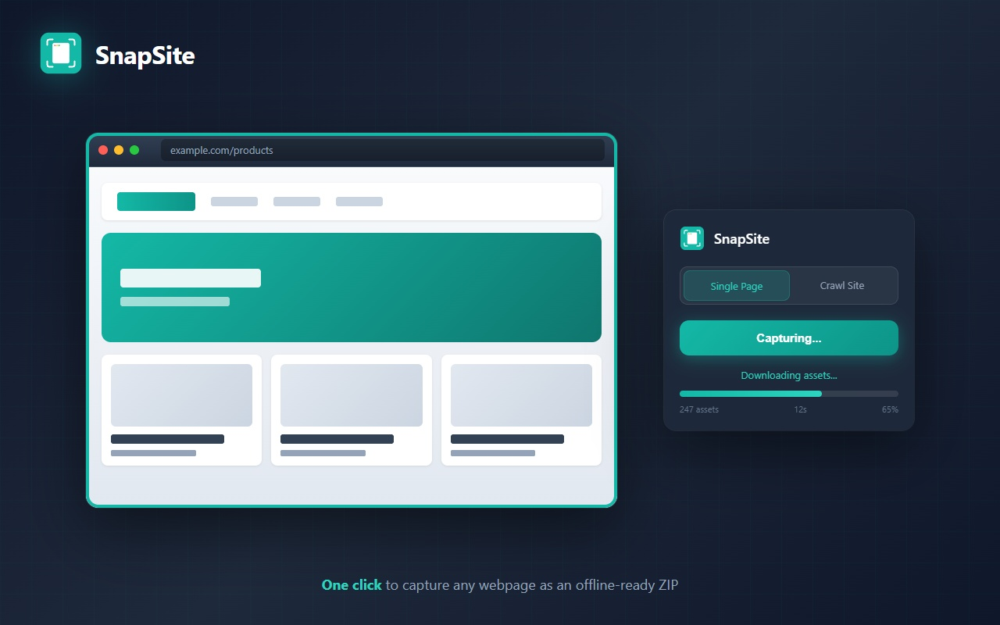

# SnapSite

**Save webpages offline with full source code & assets.** Snapshot any page with pixel-perfect accuracy or crawl multiple pages into offline-ready ZIP files. Captures everything: images, fonts, SVGs, videos, CSS, animations, forms, tables, and more.

**Works on all major browsers** including Chromium-based browsers, Firefox, and Safari.

**99%+ Site Compatibility** - Landing pages, web apps, documentation, e-commerce, news sites, and complex SPAs.



## Features

### Cross-Browser Support
- **Chromium-based**: Full support via modern extension APIs
- **Firefox**: Native browser.* API support with MV3
- **Safari**: WebExtension support (macOS 12+, iOS 15.4+)
- **Unified codebase**: Single extension works across all major browsers

### Modern CSS Support (12 @-rules)
- **@container**: Container queries for responsive components
- **@layer**: CSS Cascade Layers for style organization
- **@supports**: Feature queries for progressive enhancement
- **@scope**: CSS Scope for component isolation
- **@media print**: Print stylesheet preservation
- **@scroll-timeline**: Scroll-driven animations
- **@counter-style**: Custom list markers
- **@page**: Print page settings
- **@font-feature-values**: OpenType font features
- Plus existing: @keyframes, @property, @font-face

### Shadow DOM & Web Components
- **Recursive shadow root traversal**: Captures content from open shadow roots
- **Shadow DOM assets**: Images, backgrounds, SVGs from web components
- **Declarative Shadow DOM**: Handles `<template shadowroot>`

### Form State Preservation
- **All input types**: text, email, checkbox, radio, date, range, color, etc.
- **Textarea content**: Preserved as textContent
- **Select elements**: Selected option marked
- **Contenteditable**: innerHTML preserved
- **Datalist options**: Autocomplete suggestions kept

### HTML5 Element Support
- **`<dialog>`**: Open/closed state preserved
- **`<details>/<summary>`**: Accordion states (FAQs, collapsibles)
- **`<progress>/<meter>`**: Value preservation
- **`<output>`**: Calculated form values
- **`<map>/<area>`**: Image map coordinates
- **`<template>`**: Content detection
- **Popover API**: `[popover]` element states
- **Inert attribute**: Non-interactive region marking

### Cross-Origin & Embed Handling
- **YouTube embeds**: Thumbnail placeholders with video link
- **Vimeo embeds**: Placeholder with link
- **PDF embeds**: Download link fallback
- **Generic iframes**: Styled placeholders with hostname

### Enhanced Asset Discovery
- **Clip-path URLs**: External SVG clip-path references
- **Mask images**: CSS mask-image external URLs
- **Noscript content**: Made visible for offline viewing
- **Color scheme**: Theme-color and prefers-color-scheme preserved

### Accessibility Preservation
- **ARIA states**: expanded, selected, checked, hidden
- **Inert regions**: Preserved for screen readers
- **Semantic HTML**: All HTML5 elements maintained

### Smart Asset Filtering
- **Skips tracking scripts**: Google Analytics, GTM, Facebook Pixel, Hotjar, etc.
- **Skips analytics**: Mixpanel, Segment, Amplitude, FullStory, etc.
- **Skips third-party widgets**: Intercom, Drift, Zendesk, Crisp, etc.
- **40+ patterns**: Automatically filters scripts that would fail offline
- **Faster captures**: No wasted time on assets that will be blocked

### Table Enhancement
- **Sticky headers**: Position and styles preserved
- **Virtualized tables**: Transform removal for complete capture
- **Cell dimensions**: Width preservation

### Improved Reliability
- **UTF-8 encoding**: Charset meta tag injection prevents garbled characters
- **10s timeout per asset** (was 30s) - prevents hanging on blocked resources
- **15s hard limit** - ensures no single asset blocks the entire capture
- **Early abort**: Stops retrying when resources are blocked by ad blockers
- **Progress tracking**: Shows skipped assets count during download

### Pixel-Perfect Capture
- **Comprehensive asset discovery**: srcset, picture elements, Open Graph images, Twitter cards
- **All CSS properties**: mask-image, clip-path, cursor, filter, border-image, shape-outside
- **Pseudo-element capture**: ::before and ::after content URLs
- **Data attribute scanning**: Automatically finds images in data-src, data-bg, data-image, etc.
- **Modern image formats**: AVIF, WebP, JPEG XL support

### Enhanced Limits (10x increase)
- **50,000 max assets** (was 2,000)
- **25 concurrent downloads** (was 15)
- **500KB embed threshold** (was 100KB) - more assets embedded inline
- **2GB max ZIP size** (was 1GB)

### Smarter Downloads
- **2 optimized fetch strategies** (was 4) - faster failure detection
- **Background fallback**: Uses extension context for CORS-blocked resources
- **Cache-first fetching**: Uses browser cache when available
- **Better error recovery**: Continues even when some assets fail

### Media & Fonts
- **Video tracks**: Captures subtitles and caption files
- **Audio elements**: Full audio file capture
- **All font variants**: Every weight, style, and format
- **Icon fonts**: FontAwesome, Material Icons fully captured

### Multi-Page Site Crawling
- **Crawl entire websites** with the new "Crawl site" mode
- Same-domain only crawling prevents unbounded crawls
- Configurable max pages limit (default: 10, up to 500)
- Single ZIP output with all pages and deduplicated assets
- Real-time progress tracking in popup

### Enhanced Animation Capture
- **CSS Hover States**: `:hover`, `:focus`, `:active` rules extracted and preserved
- **JS Animation Libraries**: Detection for GSAP, Anime.js, Framer Motion, Lottie, ScrollMagic
- **Scroll-Triggered Animations**: Programmatic scrolling to capture all animation states
- **Multi-Frame Canvas**: Captures 5 frames from animated canvas elements
- **Video Poster Extraction**: Automatic poster image capture for video elements

### CSS-in-JS Support
- Extracts styles from styled-components, Emotion, Linaria, JSS
- Preserves dynamic styles that would otherwise be lost

### Performance Improvements
- **25 concurrent downloads** for fast asset fetching
- **SHA-256 deduplication** prevents redundant asset downloads
- **URL normalization** strips tracking params (utm_*, fbclid, gclid)
- **50,000 max assets** for larger sites

## Install

### Chromium-based (Chrome, Edge, etc.)
1. Download or clone this repository
2. Open `chrome://extensions` (or equivalent), enable Developer mode
3. Click "Load unpacked" and select the `SnapSite/` folder
4. Pin SnapSite in the toolbar

### Firefox
1. Open `about:debugging#/runtime/this-firefox`
2. Click "Load Temporary Add-on"
3. Select the `manifest.json` file from the `SnapSite/` folder

### Safari (macOS)
1. Enable "Allow unsigned extensions" in Safari's Develop menu
2. Open Safari > Settings > Extensions
3. Enable SnapSite

## Use

### Single Page Capture
- Open a normal, finite page (blog, docs, landing page)
- Click the SnapSite icon and select **"Single Page"**
- Click **Start capture** and save the ZIP
- Unzip and open `index.html` - works completely offline with no console errors

### Multi-Page Site Crawl
- Open any page on the site you want to capture
- Click the SnapSite icon and select **"Crawl Site"**
- Set the max pages limit (default: 10)
- Click **Start capture** to begin crawling
- Progress shows "X/Y pages" as the crawl proceeds
- Final ZIP contains all captured pages with shared assets

### Crawl Features
- **Scope**: Same domain only - external links are skipped
- **Progress**: Real-time page count and progress bar
- **Stop anytime**: Click Stop to end the crawl early
- **Memory warnings**: Alerts at 80% memory usage
- **Continues in background**: Crawl continues even if you close the popup

## What's Included

### Single Page Capture
- `index.html`: DOM snapshot with local asset paths and preserved animations
- `assets/`: downloaded CSS/JS/images/fonts/media/videos
- `report/README.md` and `report/fetch-report.json`: human + machine summary
- `quick-check.html`: loads `index.html` in an iframe and summarizes the report
- `report/asset-manifest.json`: original URL + local path, bytes, mime, sha256

### Multi-Page Crawl
```
site-capture.zip
├── index.html        (first/home page)
├── page-1.html       (subsequent pages)
├── page-2.html
├── ...
├── assets/           (deduplicated across all pages)
│   ├── image-abc123.jpg
│   ├── font-def456.woff2
│   └── ...
└── report/
    └── README.md
```

## Offline Compatibility

SnapSite creates truly offline-ready captures with zero console errors:

### Automatic Filtering (v2.1)
The following script types are automatically skipped during capture:
- **Analytics**: Google Analytics, GTM, Mixpanel, Segment, Amplitude
- **Tracking**: Facebook Pixel, Hotjar, FullStory, Mouseflow, Crazy Egg
- **Widgets**: Intercom, Drift, Zendesk, Crisp, Tawk.to, LiveChat
- **Auth**: Google Sign-In, Facebook Login, reCAPTCHA
- **Error tracking**: Sentry, Bugsnag, Rollbar, LogRocket
- **A/B testing**: Optimizely, VWO

### Asset Handling
- **CSS Inlined**: All stylesheets embedded directly in HTML
- **Fonts Embedded**: Web fonts converted to base64 (up to 500KB each)
- **Images Embedded**: Assets under 500KB embedded as base64 data URIs
- **Large Assets**: Saved to `assets/` folder with correct references
- **srcset Preserved**: All responsive image variants captured
- **UTF-8 Encoding**: Charset declaration ensures correct character display

### Comprehensive Asset Types
| Asset Type | Captured |
|------------|----------|
| Images (jpg, png, gif, webp, avif) | Yes |
| SVG (inline, external, sprites) | Yes |
| Fonts (woff, woff2, ttf, otf, eot) | Yes |
| Videos (mp4, webm) + posters | Yes |
| Audio (mp3, wav, ogg) | Yes |
| CSS (external, inline, computed) | Yes |
| Favicons (all sizes) | Yes |
| Open Graph / Twitter images | Yes |
| Background images | Yes |
| Mask images / clip-paths | Yes |
| Cursor images | Yes |
| Subtitles / captions (vtt, srt) | Yes |
| Shadow DOM content | Yes |
| Form states | Yes |

### Why This Matters
When you open a captured page from `file://`, browsers enforce strict security:
- CORS blocks loading external scripts/fonts
- CSP policies block inline styles
- Relative paths resolve incorrectly

SnapSite handles all of this automatically so your captured pages just work.

## Animation & Modern CSS Support
- **CSS Keyframe Animations**: All `@keyframes` rules are extracted and preserved
- **CSS @property**: Modern CSS custom properties with animation support captured
- **CSS Container Queries**: `@container` rules for responsive components
- **CSS Cascade Layers**: `@layer` declarations preserved
- **CSS Scope**: `@scope` rules for component isolation
- **Hover/Focus/Active States**: Pseudo-class rules captured as `.gi-hover-*` classes
- **Computed Animation States**: Animation properties (duration, timing, delay) preserved
- **Backdrop Blur & Effects**: Modern CSS filter effects like backdrop-filter maintained
- **Tailwind Animations**: Dynamic animation classes from Tailwind CSS preserved
- **Transform & Transition**: All transform and transition properties captured
- **SVG Animations**: Inline SVG animations preserved
- **Canvas Elements**: Animated canvas elements capture multiple frames
- **Video Support**: Video elements included with poster images and controls
- **Scroll Animations**: @scroll-timeline and animation-timeline support

### Animation Library Detection
SnapSite detects and notes the presence of:
- **GSAP / TweenMax / TweenLite**: Animation library states captured
- **Anime.js**: Animation states preserved
- **Framer Motion**: React animation data captured
- **Lottie / Bodymovin**: Animation player detection
- **ScrollMagic / ScrollTrigger**: Scroll animation states
- **AOS (Animate On Scroll)**: Intersection-based animations

## Carousel Support
- Automatically detects and expands all carousel slides
- Supported libraries: Slick, Swiper, Bootstrap Carousel, Splide, Keen Slider, Owl Carousel, Flickity, Glide
- All slides displayed vertically in the captured page
- Navigation controls automatically hidden since all content is visible

## Endless Pages & Limits
- Heuristic auto-scrolls until bottom is stable
- Caps: runtime, max assets, ZIP size, and concurrency (configurable in Options)
- Optional denylist in settings to block specific URL patterns

## Settings
- Options page lets you adjust caps, redact behavior, denylist, and whether to save without prompt
- **Theme**: Light, Dark, or Auto (system)
- **Strip Scripts**: Optionally remove scripts and inline handlers for offline safety
- **Redaction**: Off by default. Enable "Redact authenticated text" to replace sensitive text in saved HTML
- **Crawl settings**: Max pages, delay between captures, memory warnings
- **Animation settings**: Hover states, scroll animations, canvas frames

## Permissions
- The extension requests `tabs` permission for crawl navigation
- `host_permissions: <all_urls>` enables cross-origin asset fetching
- Core actions (injecting on the active tab, downloads, storage) work with standard permissions

## Browser Compatibility

| Platform | Minimum Version | Status |
|----------|-----------------|--------|
| Chromium-based | 88+ | Full support |
| Firefox | 109+ | Full support |
| Safari | 15.4+ | Full support |

## Notes
- Third-party iframes show placeholders with links to original content
- YouTube/Vimeo embeds show video thumbnails with links
- Tracking/analytics scripts are automatically skipped (won't cause errors)
- The popup shows live progress during capture
- For crawls, progress shows "X/Y pages" with real-time updates
- In-page overlay shows status with a Stop button during capture

