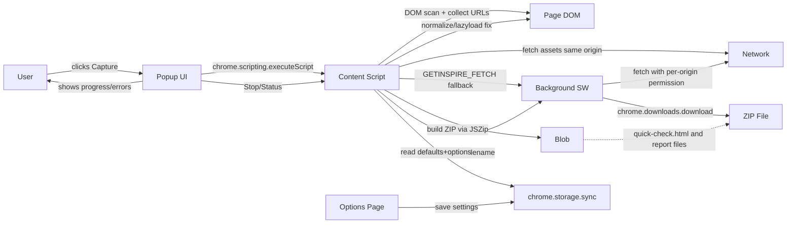
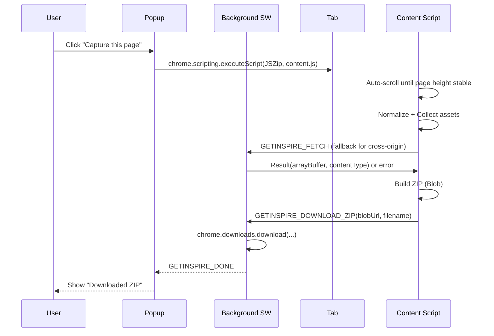
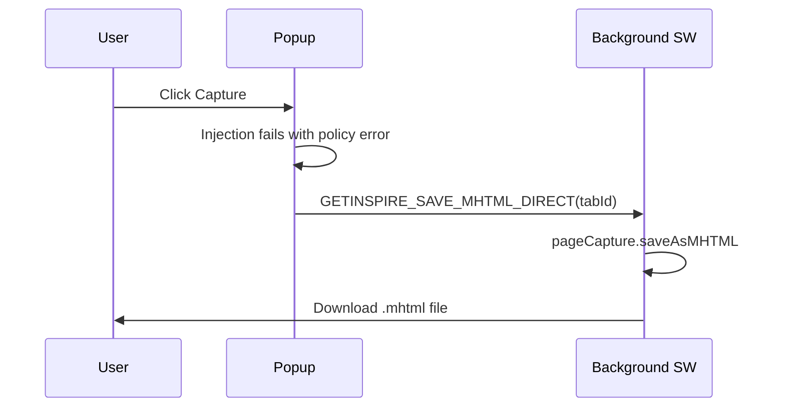

GetInspire - Chrome Extension (MV3)

Snapshot any finite web page into a ZIP that works offline: index.html + assets, plus a Quick Check page and a Fetch Report.

Install (Load Unpacked)
- Open Chrome and go to `chrome://extensions`, enable Developer mode
- Click "Load unpacked" and select the `GetInspire/` folder
- Pin GetInspire in the toolbar

Use
- Open a normal, finite page (blog, docs, landing page)
- Click "Capture this page" in the popup (or use shortcut Ctrl+Shift+S)
- Save the ZIP, unzip it, open `quick-check.html` for a fast sanity check, then `index.html`
  - Quick Check embeds the report inline, so it works even when the browser blocks `fetch()` on `file://` URLs.

What's Included
- `index.html`: DOM snapshot with local asset paths
- `assets/`: downloaded CSS/JS/images/fonts/media
- `report/README.md` and `report/fetch-report.json`: human + machine summary
- `quick-check.html`: loads `index.html` in an iframe and summarizes the report
- `report/asset-manifest.json`: original URL + local path, bytes, mime, sha256
- `report/page.mhtml`: browser-native MHTML snapshot (when available)

Endless Pages & Limits
- Denylist blocks known infinite feeds/search pages
- Heuristic auto-scrolls until bottom is stable
- Caps: runtime, max assets, ZIP size, and concurrency (configurable in Options)

Settings
- Options page lets you adjust caps, redact behavior, denylist, and whether to save without prompt
  - Defaults are shared across the extension; the Options page imports them from `src/defaults.js`.
  - Strip Scripts: optionally remove scripts and inline handlers for offline safety.
  - Redaction: off by default to avoid altering captured text. Enable "Redact authenticated text" in Options if you want sensitive text (emails/tokens/user areas) replaced in the saved HTML.

Permissions
- The extension requests per-origin host access only when needed to fetch cross-origin assets in the background. Chrome may prompt you the first time an asset needs fetching from a new domain.
- Core actions (injecting on the active tab, downloads, storage, context menus) don't require broad host access.

Notes
- Third-party iframes stay external by design and may not work offline
- Cross-origin assets can be blocked by CORS/CSP; failures are listed in the report
- The popup shows live progress during capture
- In-page overlay shows status with a Stop button during capture

---

New: Video Downloader

- Click the download icon in the popup header to detect the currently playing/visible video on the page.
- A quality menu appears. Click a quality to start the download in the background.
- Supported: direct files (MP4/WebM/Ogg) and non‑encrypted HLS (.m3u8) streams. Progress shows in the popup bar for HLS.
- Permissions: for some hosts, Chrome prompts for per‑origin access the first time. Accept the prompt to proceed.
- Not supported: DRM/Widevine, encrypted HLS (SAMPLE‑AES/AES‑128), and ciphered/MSE‑only streams many sites use (including many YouTube/course videos). These won’t expose downloadable URLs in‑page.
- Tip: If you routinely need protected streams, consider the optional native helper approach described below.

Popup UI Updates

- Top right actions: [Download video] [Settings] [Report issue].
- Progress line shows percentage, counts, and elapsed time during captures and HLS downloads.
- Settings opens in a small popup window (not a browser tab) with all options from `src/options.html`.

Options Enhancements

- Added toggles: "Show overlay" and "Font fallback" alongside existing settings.
- Denylist presets: quick buttons to insert common social/search patterns (then click Save).
- "Save without prompt": if enabled, ZIP and video downloads won’t ask for a filename.

Icons & Branding

- Updated logo and toolbar icons.
- Source SVG: `assets/logo.svg`.
- Generated PNGs: `assets/icons/16.png`, `32.png`, `48.png`, `128.png`.
- Rebuild icons after changing the SVG:

  ```bash
  npm install
  node tools/build-icons.js
  ```

Troubleshooting Video Downloads

- Permission denied for video host: click the quality again and accept Chrome’s permission prompt. The prompt must be accepted under your click.
- No downloadable video found on YouTube: many videos are protected via MSE/DRM; the extension cannot extract those in‑page.
- Encrypted HLS message: the stream uses encryption (e.g., SAMPLE‑AES). Decryption is out of scope for the in‑extension downloader.

Roadmap (Optional)

- Native helper integration (yt‑dlp via Native Messaging) to support YouTube/courses reliably, still triggering downloads from the extension UI.
- DASH (MPD) parsing support for broader site coverage.

Native Helper (yt‑dlp) — Installation

For robust YouTube/course downloads, install the optional native helper that bridges the extension to `yt-dlp`.

Prereqs
- Install Node.js (v16+). https://nodejs.org/
- Install `yt-dlp` and put it in PATH. https://github.com/yt-dlp/yt-dlp/releases

Windows install
1. Find your extension ID: open `chrome://extensions`, enable Developer mode, copy the 32‑char ID for GetInspire.
2. Open PowerShell, cd into the repo folder.
3. Run: `powershell -ExecutionPolicy Bypass -File native/install-windows.ps1 -ExtensionId <your_id>`
   - Optional for Edge, add `-AlsoEdge`.
4. Ensure `yt-dlp` is in PATH (`yt-dlp -h` works) and `node` is installed.
5. Reload the extension at `chrome://extensions`.

Usage
- Click the download icon in the popup. You’ll see a “yt-dlp (best)” option.
- Picking this will hand the page URL to `yt-dlp`; progress appears in the popup.

If you see “yt-dlp host disconnected”
- Extension ID not registered: re-run the installer with `-ExtensionId <your_id>`.
- Node or yt-dlp missing from PATH: install them and retry.
- Verify host registration: check `HKCU\Software\Google\Chrome\NativeMessagingHosts\com.getinspire.ytdlp` and that it points to `native\com.getinspire.ytdlp.json`.

Uninstall helper
- Remove registry key `HKCU\Software\Google\Chrome\NativeMessagingHosts\com.getinspire.ytdlp` and delete the `native/` folder.

Architecture Overview



Capture Flow


Sequence: Main Capture



Sequence: Policy Fallback (MHTML)

Some sites are enterprise-managed or block scripting via policy. The popup falls back to a single-file MHTML snapshot.



Blobs and Object URLs

- Blob: immutable, in-memory object that represents binary data. JSZip produces a `Blob` containing the assembled ZIP.
- Object URL: temporary URL created by `URL.createObjectURL(blob)` used to hand the Blob to the background for `chrome.downloads.download`.
- Lifetime: we revoke it after download (`URL.revokeObjectURL`) to release memory. See:
  - `src/content.js` (buildZip + handoff)
  - `src/background.js` (revocation handled in the creating context)
- Why not ArrayBuffer only? Object URLs avoid large message copies across the extension boundary on some browsers and are widely supported. A fallback path exists to reconstruct the Blob in the background if needed.

Operational Flows

- Endless detection: height-stability heuristic avoids false positives on dynamic pages. Iteration cap now proceeds with capture when reached.
- Redaction: off by default. When enabled, conservative selectors replace sensitive text with lorem-ipsum in the saved HTML; live page is never modified.
- Denylist: blocks known infinite feeds by URL regex; editable in Options. YouTube `/feed/playlists` is allowed, other YouTube feed pages are blocked.

Developer Notes

- Key files: `src/content.js`, `src/background.js`, `src/popup.*`, `src/options.*`, `src/defaults.js`.
- Commands: use the keyboard shortcut `Ctrl+Shift+S` or popup button to capture; `Ctrl+Shift+X` to stop.
- Testing tips:
  - Use the Quick Check page in the ZIP for a fast sanity pass.
  - Inspect `report/README.md` and `report/asset-manifest.json` for coverage and failures.
