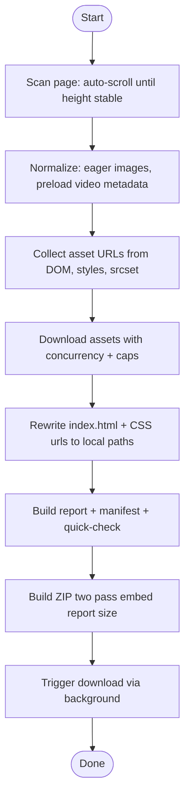
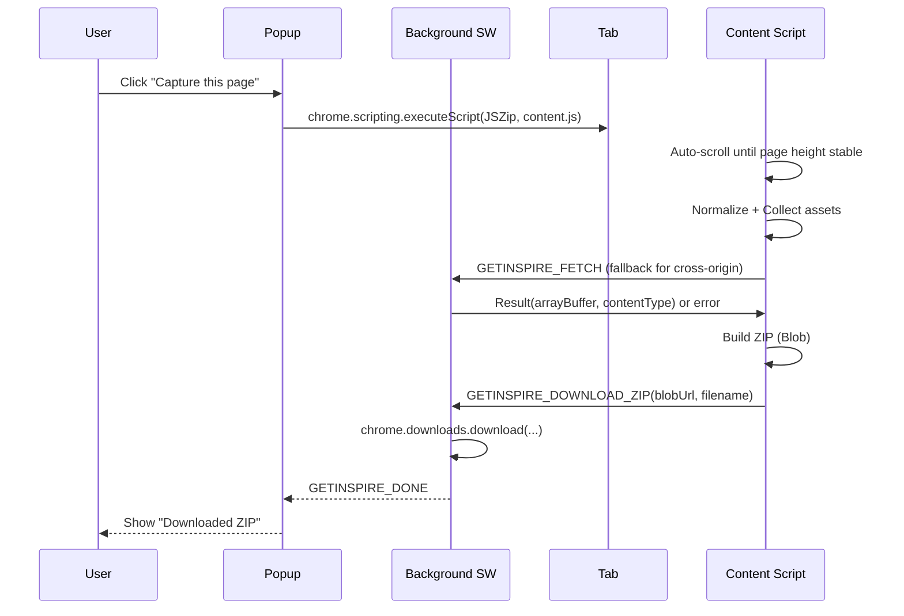
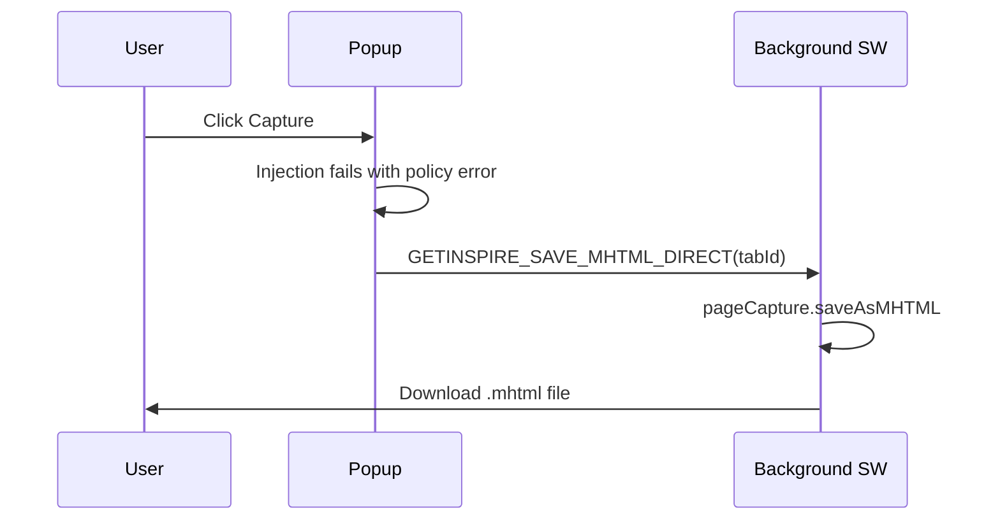

GetInspire - Chrome Extension (MV3)

Snapshot any finite web page into a ZIP that works offline: index.html + assets, plus a Quick Check page and a Fetch Report.

Install (Load Unpacked)
- Open Chrome and go to `chrome://extensions`, enable Developer mode
- Click "Load unpacked" and select the `GetInspire/` folder
- Pin GetInspire in the toolbar

Use
- Open a normal, finite page (blog, docs, landing page)
- Click "Capture this page" in the popup (or use shortcut Ctrl+Shift+S)
- Save the ZIP, unzip it, open `quick-check.html` for a fast sanity check, then `index.html`
  - Quick Check embeds the report inline, so it works even when the browser blocks `fetch()` on `file://` URLs.

What's Included
- `index.html`: DOM snapshot with local asset paths
- `assets/`: downloaded CSS/JS/images/fonts/media
- `report/README.md` and `report/fetch-report.json`: human + machine summary
- `quick-check.html`: loads `index.html` in an iframe and summarizes the report
- `report/asset-manifest.json`: original URL + local path, bytes, mime, sha256
- `report/page.mhtml`: browser-native MHTML snapshot (when available)

Endless Pages & Limits
- Denylist blocks known infinite feeds/search pages
- Heuristic auto-scrolls until bottom is stable
- Caps: runtime, max assets, ZIP size, and concurrency (configurable in Options)

Settings
- Options page lets you adjust caps, redact behavior, denylist, and whether to save without prompt
  - Defaults are shared across the extension; the Options page imports them from `src/defaults.js`.
  - Strip Scripts: optionally remove scripts and inline handlers for offline safety.
  - Redaction: off by default to avoid altering captured text. Enable "Redact authenticated text" in Options if you want sensitive text (emails/tokens/user areas) replaced in the saved HTML.

Permissions
- The extension requests per-origin host access only when needed to fetch cross-origin assets in the background. Chrome may prompt you the first time an asset needs fetching from a new domain.
- Core actions (injecting on the active tab, downloads, storage, context menus) don't require broad host access.

Notes
- Third-party iframes stay external by design and may not work offline
- Cross-origin assets can be blocked by CORS/CSP; failures are listed in the report
- The popup shows live progress during capture
- In-page overlay shows status with a Stop button during capture

---

Architecture Overview

```mermaid
graph LR
  A[User] -->|clicks Capture| P[Popup UI]
  P -->|chrome.scripting.executeScript| C[Content Script]
  P -->|Stop/Status| C
  C -->|DOM scan + collect URLs| D[Page DOM]
  C -->|normalize/lazyload fix| D
  C -->|fetch assets same origin| Net[Network]
  C -->|GETINSPIRE_FETCH (fallback)| B[Background SW]
  B -->|fetch with per-origin permission| Net
  C -->|build ZIP via JSZip| Z[Blob]
  C -->|send blobUrl + filename| B
  B -->|chrome.downloads.download| File[ZIP File]
  Z -.->|quick-check.html and report files| File
  P -->|shows progress/errors| A
  O[Options Page] -->|save settings| Sync[chrome.storage.sync]
  C -->|read defaults+options| Sync
```

Capture Flow



Sequence: Main Capture



Sequence: Policy Fallback (MHTML)

Some sites are enterprise-managed or block scripting via policy. The popup falls back to a single-file MHTML snapshot.



Blobs and Object URLs

- Blob: immutable, in-memory object that represents binary data. JSZip produces a `Blob` containing the assembled ZIP.
- Object URL: temporary URL created by `URL.createObjectURL(blob)` used to hand the Blob to the background for `chrome.downloads.download`.
- Lifetime: we revoke it after download (`URL.revokeObjectURL`) to release memory. See:
  - `src/content.js` (buildZip + handoff)
  - `src/background.js` (revocation handled in the creating context)
- Why not ArrayBuffer only? Object URLs avoid large message copies across the extension boundary on some browsers and are widely supported. A fallback path exists to reconstruct the Blob in the background if needed.

Operational Flows

- Endless detection: height-stability heuristic avoids false positives on dynamic pages. Iteration cap now proceeds with capture when reached.
- Redaction: off by default. When enabled, conservative selectors replace sensitive text with lorem-ipsum in the saved HTML; live page is never modified.
- Denylist: blocks known infinite feeds by URL regex; editable in Options. YouTube `/feed/playlists` is allowed, other YouTube feed pages are blocked.

Developer Notes

- Key files: `src/content.js`, `src/background.js`, `src/popup.*`, `src/options.*`, `src/defaults.js`.
- Commands: use the keyboard shortcut `Ctrl+Shift+S` or popup button to capture; `Ctrl+Shift+X` to stop.
- Testing tips:
  - Use the Quick Check page in the ZIP for a fast sanity pass.
  - Inspect `report/README.md` and `report/asset-manifest.json` for coverage and failures.
