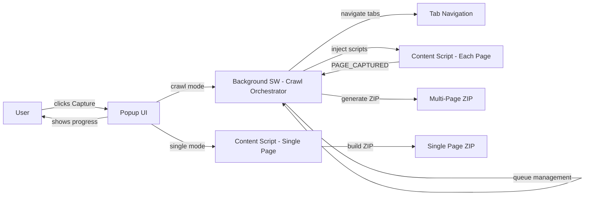
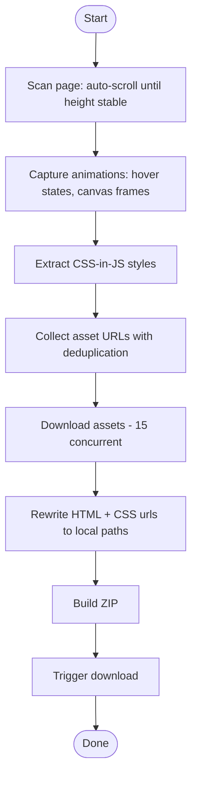
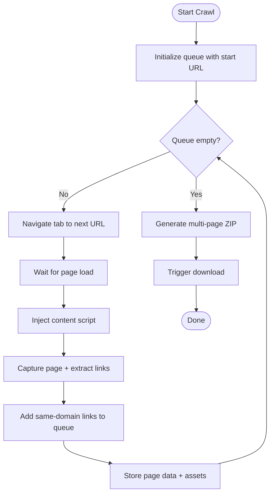
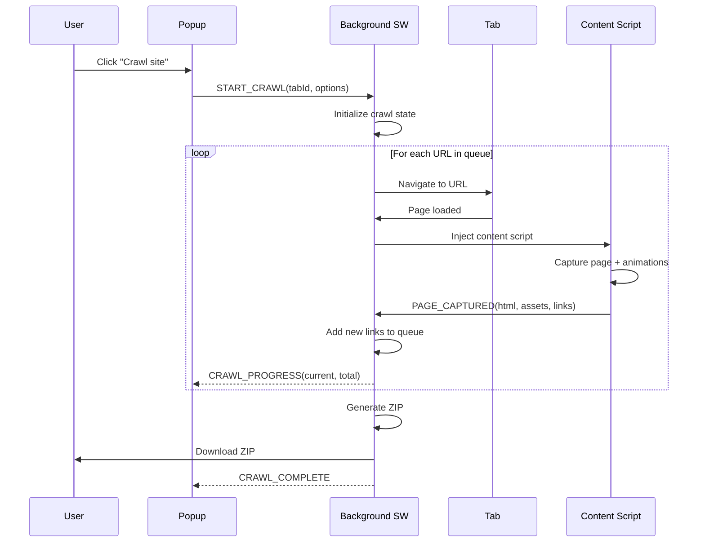

# GetInspire v2.0 - Chrome Extension (MV3)

Snapshot any finite web page or crawl entire sites into a ZIP that works offline: index.html + assets, plus a Quick Check page and a Fetch Report.

## What's New in v2.0

### Multi-Page Site Crawling
- **Crawl entire websites** with the new "Crawl site" mode
- Same-domain only crawling prevents unbounded crawls
- Configurable max pages limit (default: 10, up to 500)
- Single ZIP output with all pages and deduplicated assets
- Real-time progress tracking in popup

### Enhanced Animation Capture
- **CSS Hover States**: `:hover`, `:focus`, `:active` rules extracted and preserved
- **JS Animation Libraries**: Detection for GSAP, Anime.js, Framer Motion, Lottie, ScrollMagic
- **Scroll-Triggered Animations**: Programmatic scrolling to capture all animation states
- **Multi-Frame Canvas**: Captures 5 frames from animated canvas elements
- **Video Poster Extraction**: Automatic poster image capture for video elements

### CSS-in-JS Support
- Extracts styles from styled-components, Emotion, Linaria, JSS
- Preserves dynamic styles that would otherwise be lost

### Performance Improvements
- **15 concurrent downloads** (was 6) for 2.5x faster asset fetching
- **SHA-256 deduplication** prevents redundant asset downloads
- **URL normalization** strips tracking params (utm_*, fbclid, gclid)
- **2000 max assets** (was 500) for larger sites

## Install (Load Unpacked)
- Open Chrome and go to `chrome://extensions`, enable Developer mode
- Click "Load unpacked" and select the `GetInspire/` folder
- Pin GetInspire in the toolbar

## Use

### Single Page Capture
- Open a normal, finite page (blog, docs, landing page)
- Click the GetInspire icon and select **"This page"**
- Save the ZIP, unzip it, open `quick-check.html` for a fast sanity check, then `index.html`

### Multi-Page Site Crawl
- Open any page on the site you want to capture
- Click the GetInspire icon and select **"Crawl site"**
- Set the max pages limit (default: 10)
- Click **Start** to begin crawling
- Progress shows "X/Y pages" as the crawl proceeds
- Final ZIP contains all captured pages with shared assets

### Crawl Features
- **Scope**: Same domain only - external links are skipped
- **Progress**: Real-time page count and progress bar
- **Stop anytime**: Click Stop to end the crawl early
- **Memory warnings**: Alerts at 80% memory usage
- **Continues in background**: Crawl continues even if you close the popup

## Theme
- Choose Light, Dark, or Auto (system) theme
- Change it in Options (Theme section) or from the popup header via the Theme button

## What's Included

### Single Page Capture
- `index.html`: DOM snapshot with local asset paths and preserved animations
- `assets/`: downloaded CSS/JS/images/fonts/media/videos
- `report/README.md` and `report/fetch-report.json`: human + machine summary
- `quick-check.html`: loads `index.html` in an iframe and summarizes the report
- `report/asset-manifest.json`: original URL + local path, bytes, mime, sha256

### Multi-Page Crawl
```
site-capture.zip
├── index.html        (first/home page)
├── page-1.html       (subsequent pages)
├── page-2.html
├── ...
├── assets/           (deduplicated across all pages)
│   ├── image-abc123.jpg
│   ├── font-def456.woff2
│   └── ...
└── report/
    └── README.md
```

## Animation & Modern CSS Support
- **CSS Keyframe Animations**: All `@keyframes` rules are extracted and preserved
- **CSS @property**: Modern CSS custom properties with animation support captured
- **Hover/Focus/Active States**: Pseudo-class rules captured as `.gi-hover-*` classes
- **Computed Animation States**: Animation properties (duration, timing, delay) preserved
- **Backdrop Blur & Effects**: Modern CSS filter effects like backdrop-filter maintained
- **Tailwind Animations**: Dynamic animation classes from Tailwind CSS preserved
- **Transform & Transition**: All transform and transition properties captured
- **SVG Animations**: Inline SVG animations preserved
- **Canvas Elements**: Animated canvas elements capture multiple frames
- **Video Support**: Video elements included with poster images and controls

### Animation Library Detection (v2.0)
GetInspire detects and notes the presence of:
- **GSAP / TweenMax / TweenLite**: Animation library states captured
- **Anime.js**: Animation states preserved
- **Framer Motion**: React animation data captured
- **Lottie / Bodymovin**: Animation player detection
- **ScrollMagic / ScrollTrigger**: Scroll animation states
- **AOS (Animate On Scroll)**: Intersection-based animations

## Carousel Support
- Automatically detects and expands all carousel slides
- Supported libraries: Slick, Swiper, Bootstrap Carousel, Splide, Keen Slider, Owl Carousel, Flickity, Glide
- All slides displayed vertically in the captured page
- Navigation controls automatically hidden since all content is visible

## Endless Pages & Limits
- Denylist blocks known infinite feeds/search pages
- Heuristic auto-scrolls until bottom is stable
- Caps: runtime, max assets, ZIP size, and concurrency (configurable in Options)

## Settings
- Options page lets you adjust caps, redact behavior, denylist, and whether to save without prompt
  - Theme: Light, Dark, or Auto (system)
  - Defaults are shared across the extension; the Options page imports them from `src/defaults.js`
  - Strip Scripts: optionally remove scripts and inline handlers for offline safety
  - Redaction: off by default. Enable "Redact authenticated text" to replace sensitive text in saved HTML

### New v2.0 Options
| Option | Default | Description |
|--------|---------|-------------|
| `enableCrawl` | `true` | Enable multi-page crawling |
| `defaultMaxPages` | `10` | Default page limit for crawls |
| `crawlDelay` | `500` | Milliseconds between page captures |
| `memoryWarningPct` | `80` | Warn at this memory usage percentage |
| `captureHoverStates` | `true` | Capture CSS :hover/:focus/:active rules |
| `captureScrollAnimations` | `true` | Trigger scroll animations before capture |
| `captureCanvasFrames` | `true` | Capture multiple canvas frames |
| `canvasFrameCount` | `5` | Number of canvas frames to capture |
| `detectAnimationLibraries` | `true` | Detect GSAP, Anime.js, etc. |
| `optimizeImages` | `false` | Resize large images |
| `maxImageDimension` | `2000` | Max image width/height when optimizing |
| `imageQuality` | `0.85` | JPEG quality when optimizing |
| `extractCSSInJS` | `true` | Extract styled-components, Emotion, etc. |
| `deduplicateAssets` | `true` | SHA-256 deduplication for assets |

## Permissions
- The extension requests `tabs` permission for crawl navigation
- `host_permissions: <all_urls>` enables cross-origin asset fetching
- Core actions (injecting on the active tab, downloads, storage) work with standard permissions

## Notes
- Third-party iframes stay external by design and may not work offline
- Cross-origin assets can be blocked by CORS/CSP; failures are listed in the report
- The popup shows live progress during capture
- For crawls, progress shows "X/Y pages" with real-time updates
- In-page overlay shows status with a Stop button during capture

## Popup UI
- Mode selector: **This page** | **Crawl site**
- Top right actions: [Settings] [Theme]
- Progress line shows percentage, counts, and elapsed time during captures
- Settings opens in a small popup window with all options

## Architecture Overview



## Capture Flow

### Single Page


### Multi-Page Crawl


## Sequence: Crawl Mode



## Blobs and Object URLs

- Blob: immutable, in-memory object that represents binary data. JSZip produces a `Blob` containing the assembled ZIP.
- Object URL: temporary URL created by `URL.createObjectURL(blob)` used to hand the Blob to the background for `chrome.downloads.download`.
- Lifetime: we revoke it after download (`URL.revokeObjectURL`) to release memory.

## Developer Notes

- Key files: `src/content.js`, `src/background.js`, `src/popup.*`, `src/options.*`, `src/defaults.js`
- Commands: use the keyboard shortcut `Ctrl+Shift+S` or popup button to capture; `Ctrl+Shift+X` to stop
- Testing tips:
  - Use the Quick Check page in the ZIP for a fast sanity pass
  - Inspect `report/README.md` and `report/asset-manifest.json` for coverage and failures
  - Test crawl mode on documentation sites with 10-20 pages
  - Verify animation capture on sites using GSAP or Anime.js

## Changelog

### v2.0.0
- Added multi-page site crawling with same-domain scope
- Added CSS hover/focus/active state capture
- Added JS animation library detection (GSAP, Anime.js, Framer Motion, Lottie)
- Added scroll-triggered animation capture
- Added multi-frame canvas capture
- Added CSS-in-JS extraction (styled-components, Emotion, Linaria, JSS)
- Added SHA-256 asset deduplication
- Added video poster extraction
- Increased concurrency to 15 (was 6)
- Increased max assets to 2000 (was 500)
- Added URL normalization (strips tracking params)
- Added memory usage warnings
- New popup UI with mode selector

### v1.x
- Single page capture
- Basic animation support
- Carousel expansion
- Asset downloading with concurrency
