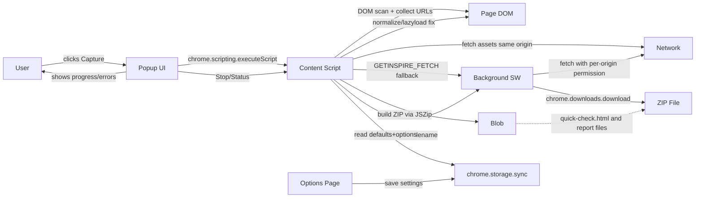
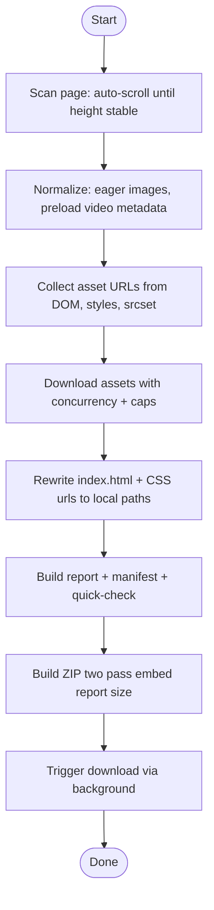
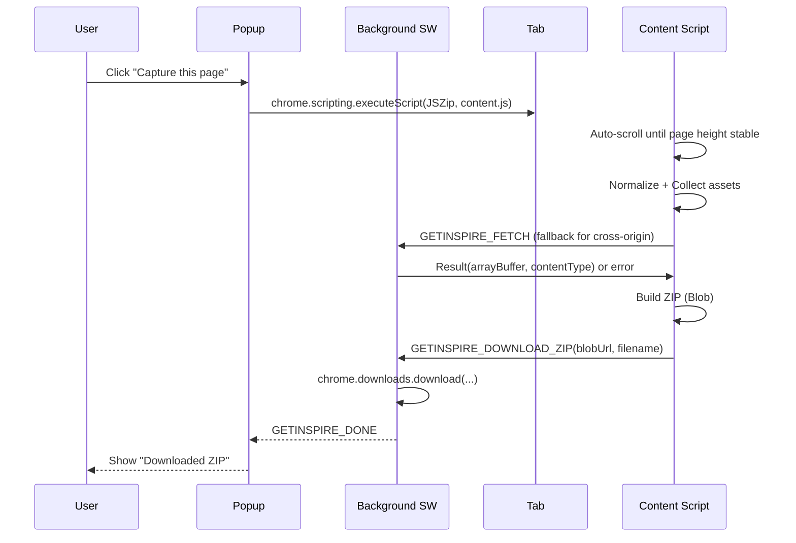
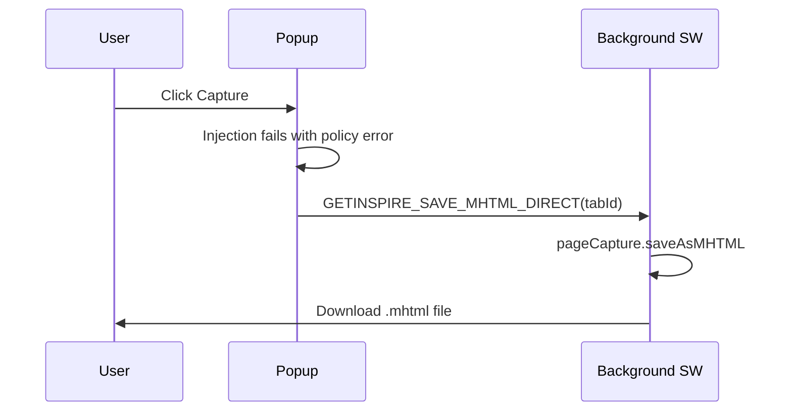

# Architecture

## Architecture Overview

## Capture Flow

## Sequence: Main Capture

## Sequence: Policy Fallback (MHTML)

Some sites are enterprise-managed or block scripting via policy. The popup falls back to a single-file MHTML snapshot.

## Blobs and Object URLs

- Blob: immutable, in-memory object that represents binary data. JSZip produces a `Blob` containing the assembled ZIP.
- Object URL: temporary URL created by `URL.createObjectURL(blob)` used to hand the Blob to the background for `chrome.downloads.download`.
- Lifetime: we revoke it after download (`URL.revokeObjectURL`) to release memory. See:
  - `src/content.js` (buildZip + handoff)
  - `src/background.js` (revocation handled in the creating context)
- Why not ArrayBuffer only? Object URLs avoid large message copies across the extension boundary on some browsers and are widely supported. A fallback path exists to reconstruct the Blob in the background if needed.

## Operational Flows

- Endless detection: height-stability heuristic avoids false positives on dynamic pages. Iteration cap now proceeds with capture when reached.
- Redaction: off by default. When enabled, conservative selectors replace sensitive text with lorem-ipsum in the saved HTML; live page is never modified.
- Denylist: blocks known infinite feeds by URL regex; editable in Options. YouTube `/feed/playlists` is allowed, other YouTube feed pages are blocked.
